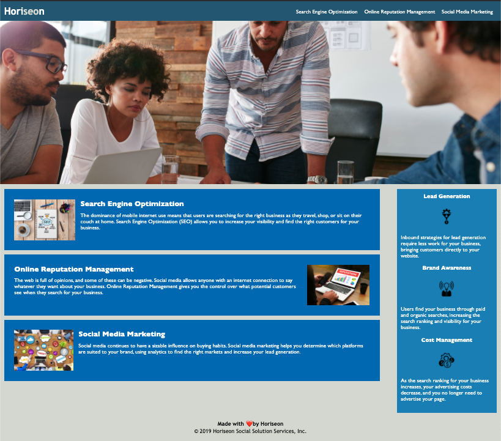

# hw-01-code-refactor

## The Repository
___
This homework is stored in the "hw-01-code-refactor" repositoty on Alix's github account (username: awebb8). All HTML, CSS, and image files are stored here. This repository is public.

## Project Goal
Refactor Horiseon's website to make it accessible.  Clean up the code, and improve the codebase for long term sustainability.  Ensure that all links are functioning correctly and clean up the CSS to make it more efficient, consolidating CSS selectors and properties, organizing them to follow the semantic structure of the HTML elements, and including comments before each element or section of the page.

## Horiseon Website
___

### Header
The header of this website includes the company name, Horiseon, and three navigation links.  When the links are clicked on, they take the user to the respective section of the page's main content.

### Hero Image
Horiseon's website includes a hero image.  This is a large image that is displayed at the top of the website.  This image is the user's first glimpse of the company.

### Content
The site's main content includes three articles about the company's main offerings:  Search Engine Optimization, Online Reputation Management, and Social Media Marketing.  Each of these articles include an image that provides the user with a visual representation of their abilities.

### Benefits Sidebar
The website includes a sidebar section, which is displayed to the right of the Content section. This section details three key benefits of working with Horiseon.  These benefits include Lead Generation, Brand Awareness, and Cost Management.  Each benefit has an icon associated with it that is displayed below it.

## Reset Feature
___
The coding of this website includes a reset file ("reset.css") so that it will be accessible across multiple browsers.

## Credits
___
The original code for Horiseon's website was provided by Trilogy Education Services.